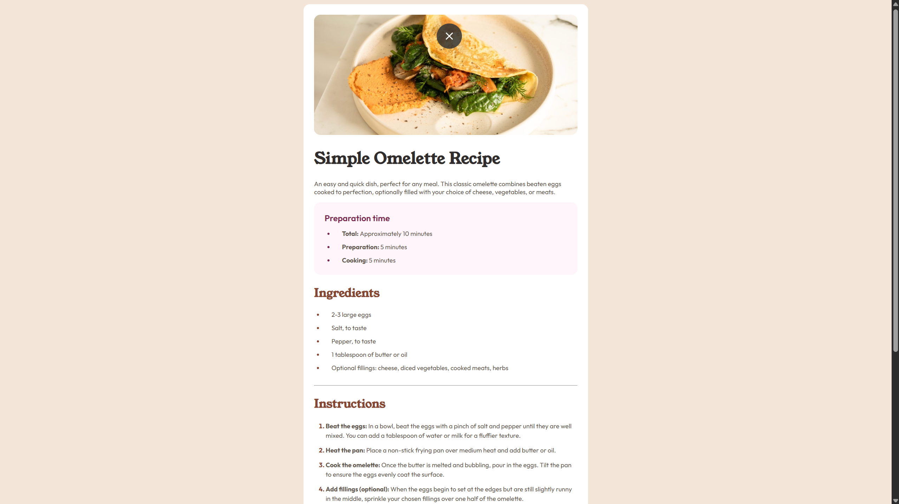
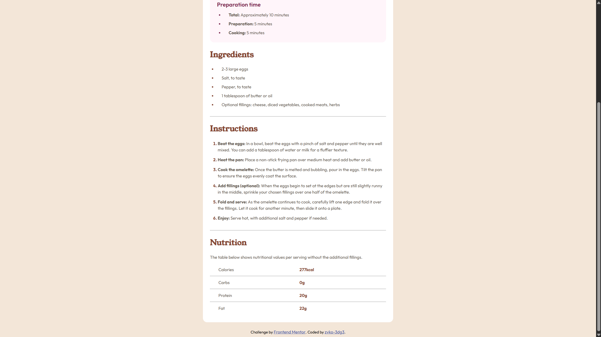

# Frontend Mentor - Recipe page solution

This is a solution to the [Recipe page challenge on Frontend Mentor](https://www.frontendmentor.io/challenges/recipe-page-KiTsR8QQKm). Frontend Mentor challenges help you improve your coding skills by building realistic projects.

## Table of contents

- [Overview](#overview)
  - [The challenge](#the-challenge)
  - [Screenshot](#screenshot)
  - [Links](#links)
- [My process](#my-process)
  - [Built with](#built-with)
  - [What I learned](#what-i-learned)
  - [Continued development](#continued-development)
- [Author](#author)

## Overview

### The challenge

Users should be able to:

- View the optimal layout depending on their device’s screen size

### Screenshot

### Links

- Solution URL: [Solution]()
- Live Site URL: [Live Site]()

## My process

### Built with

- Semantic HTML5 markup
- Flexbox
- Desktop-first workflow

### What I learned

This challenge helped me practice **semantic HTML structure** and **typography control with custom fonts**.  
I also learned how to customize **list styles** (especially numbered lists) using `::marker`, and how to create a visually appealing recipe layout with subtle background and color contrasts.

Here’s a small CSS snippet I’m proud of:

.instructions-list > li::marker {
  color: hsl(14, 45%, 36%);
  font-weight: 700;
}

Continued development
I’d like to keep improving my understanding of responsive layouts and accessibility in future challenges, especially using CSS Grid and media queries.

## Author

- Frontend Mentor - [@zvko-3dg3](https://www.frontendmentor.io/profile/zvko-3dg3)

- GitHub - [@zvko-3dg3](https://github.com/zvko-3dg3)